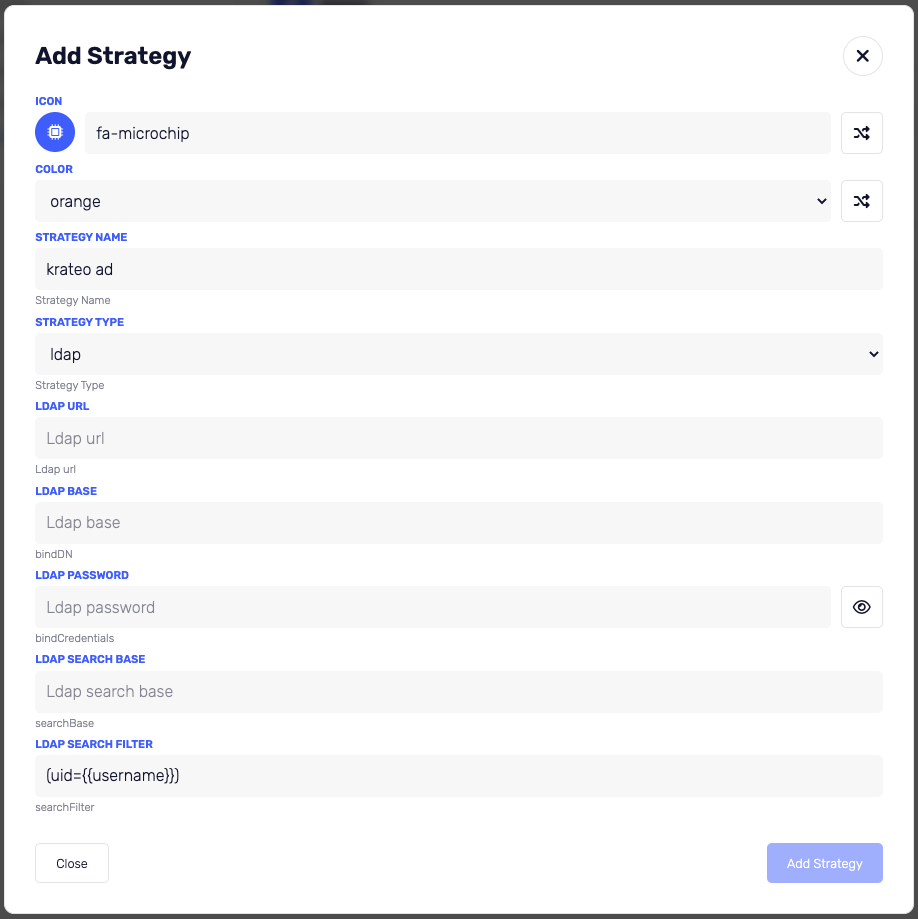

# Settings

The settings page allows you to get information about your

- [Settings](#settings)
  - [Profile](#profile)
  - [Endpoints](#endpoints)
  - [Secrets](#secrets)
  - [Components](#components)
  - [Authentication](#authentication)

## Profile

The profile section shows you your account information and the logout button.
Your profile is composed by

- id
- display name
- username
- email

If you log in with guest method you will have the guest@krateo.io email.

## Endpoints

Endpoints are used to connect to your data sources. You can create, edit and delete endpoints.
Currently we support the following data sources

- argocd
- bitbucket
- github
- jenkins
- keptn
- sonarcloud
- typeform

Every endpoint requires

- icon
- endpoint name (display name)
- target url
- endpoint type

The `endpoint type` is used to determine which data source you want to connect to, and every endpoint requires different settings, for example, github requires only a token, while jenkins requires a username and a token.

## Secrets

Secrets are used to store sensitive information like tokens, passwords, etc. You can create, edit and delete secrets.
Secret aren't used directly by the app or services, but they are used by the compositions.

Currently we support the following secret types

- aws
- [custom]

Every secret requires

- icon
- secret name (display name)
- secret type

The AWS type requires credentials, instead the custom type allows to you to create everything you need using key/value method.

## Components

In this section the app will display all the services installed in your cluster.
Every service is composed by

- version
- name
- status code (200 ok, 500 error)

## Authentication

In this section you can enable/disable the authentication method you want to use.
By default krateo is installed with guest strategy, but you can enable the following methods:

- basic
- github
- guest
- ldap
- microsoft

Every strategy requires

- icon
- color
- strategy nane (display name)
- strategy type

For example, here you can view how many settings the ldap strategy requires.

