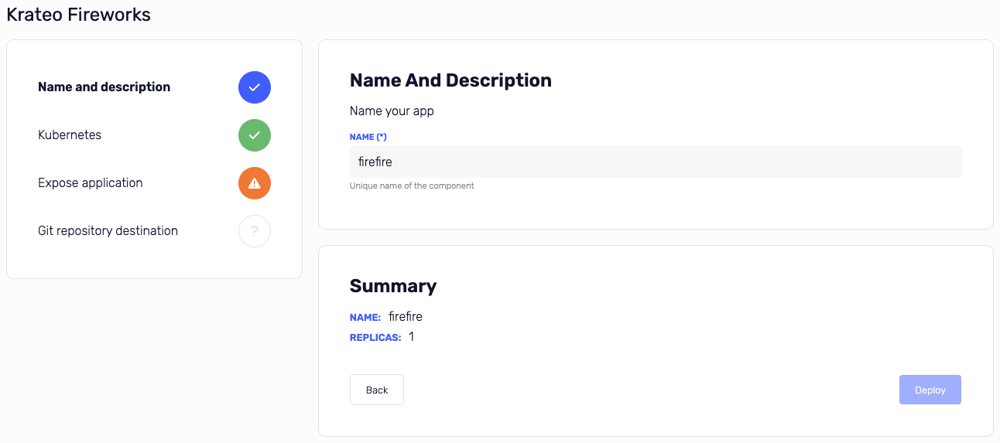

# Templates


Templates are the way to create deployments.

Every template card has this information:

- icon
- name
- description
- tags
- link to template git repository (git icon bottom left)
- refresh button (bottom right)
- delete button (bottom right)

The `refresh button` is used to update the template from the git repository.

## Use a template



To use a template, click on the template card.

A form will appear with the template parameters, on the left you can see the template steps and relative status.

On the right you can see the form of the current step and the summary of this deployment.

Until the deployment is not completed, you can't use the `Deploy` button.

## Template.yaml

### Structure

- `apiVersion`: krateo.io/v1alpha1
- `kind`: Template

### Metadata

- `name`: name of the template

### Spec

- `owner`: owner of the template
- `title`: title of the template
- `description`: description of the template
- `icon`: fontawesome icon name. List of available icons is here [fontawesome.com](https://fontawesome.com/icons)
- `tags`: array of tags to identify your template
- `widgets`: array of widgets (steps)

#### Widget

- `title`: title of the step
- `description`: description of the step
- `properties`: array of fields

##### Property

- `title`: title of the field (required)
- `description`: description of the field
- `key`: is the id of the field, it will be used in the deployment.yaml (required)
- `required`: true/false
- `default`: default value of the field
- `type`: type of the field (default is text)
- `options`: array of options (only for select/radio type)
- `box`: display an info box on the right of the form
- `style`: default style is 'default', available styles are
  - info (blue)
  - warning (orange)
  - success (green)
  - error (red)

###### Types

- `text`: text field (default)
- `textarea`: textarea field
- `url`: url field
- `password`: password field (hidden value in summary)
- `endpoint`: [endpoint](./app-settings.md#endpoints) field
- `radio`: radio field
- `select`: select field
- `multiple`: multiple field
- `box`: info box

###### Options

- `title`: title of the option
- `value`: value of the option (string)

### Example

Here you can find a template example:

```yaml
apiVersion: krateo.io/v1alpha1
kind: Template
metadata:
  name: krateo-fireworks
spec:
  owner: mauro.sala@kiratech.it
  title: Krateo Fireworks
  description: Krateo Fireworks Template
  icon: fa-solid fa-fire
  tags:
    - fireworks
    - template
    - krateo
    - katy perry
  widgets:
    - title: Name and description
      description: Name your app
      properties:
        - title: Name
          key: name
          description: Unique name of the component
          required: true
          default: firefire
    - title: Kubernetes
      properties:
        - title: Replicas
          key: replicas
          description: Number of replicas
          type: radio
          required: true
          default: '1'
          options:
            - title: '1'
              value: '1'
            - title: '2'
              value: '2'
            - title: '3'
              value: '3'
    - title: Expose application
      description: Expose your application
      properties:
        - title: Host
          key: host
          description: Hostname of the application
          required: true
          default: fireworks.krateo.site
    - title: Git repository destination
      properties:
        - title: Endpoint
          key: destinationEndpoint
          description: github.com / gitlab.com / bitbucket.org
          required: true
          type: endpoint
```

The above file is hosted in the [krateo-template-fireworksapp](https://github.com/krateoplatformops/krateo-template-fireworksapp/) GitHub repository.

```
https://github.com/krateoplatformops/krateo-template-fireworksapp/blob/main/template.yaml
```

## Template repository

The template repository is a git repository that contains the template.yaml file and the others file that must be cloned in the target repository.

### Structure

- `template.yaml` (file): [template](#templateyaml) file
- `deployment.yaml` (file): deployment file
- `.krateoignore` (file): list of file/folders to ignore placeholder substitution in the target repository
- `skeleton` (folder): this folder will be cloned in the target repository
- `package.yaml` (file): composition package file
- `crossplane.yaml` (file): crossplane file

#### .krateoignore

The `.krateoignore` file is a list of file/folders to ignore placeholder substitution in the target repository.
It works like the `.gitignore` file.

#### Skeleton folder

This folder contains the files that will be cloned in the target repository.
in every file you can use the placeholder that will be replaced with the values of the form.

Let's show this example:

```yaml
# {{=<% %>=}}
---
namespace: <% repositoryName %>-ns
image: ghcr.io/<% organizationName %>/<% repositoryName %>:latest
replicas: <% replicas %>
name: <% repositoryName %>
host: <% host %>
```

This example is a `values.yaml` file of a helm chart.

In Krateo, we use [mustache](https://mustache.github.io/) syntax to define the placeholder, in the first line we define the syntax, in this case we use `<% %>` instead of `{{ }}`.
