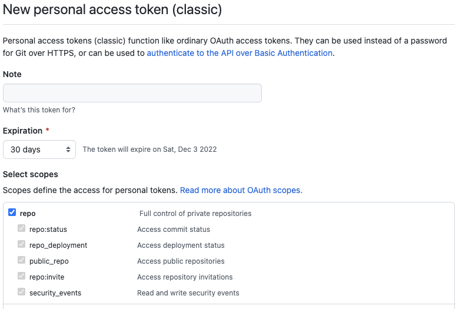

# Add Endpoint

## GitHub Token

1. Go to [GitHub Developer Settings](https://github.com/settings/apps)
2. On the left menu click on `Personal access tokens`
3. On the top right click on `Generate new token` (classic token should be fine)
4. Here you can give the token a name and select the scopes you want to give it
   
   Customize the expiration date to your needs.

   Grant repo permissions to the token.

   Add also the `delete_repo` permission and `write:packages` permission

5. Copy the token and save it somewhere safe

## Add the token to Krateo

1. Login to Krateo
2. Click on the left menu to `Settings`
3. On the menu in the right pane click on `Endpoints`
4. Click on the `plus button` to add a new endpoint (top right)
5. Fill the form as this example
   
   - `icon` is the icon you want to use for the endpoint
   - `Name` is the name of the endpoint
   - `Target` is the URL of the endpoint (if you use github.com you can use `https://api.github.com`)
   - `endpoint type` is _github_
   - `github token` is the token you created in the previous step
6. If you have filled all the fields correctly you should see that the `Add Endpoint` button is now enabled
7. Click on the `Add Endpoint` button to add the endpoint to Krateo
8. Well done! You have added your first endpoint to Krateo
