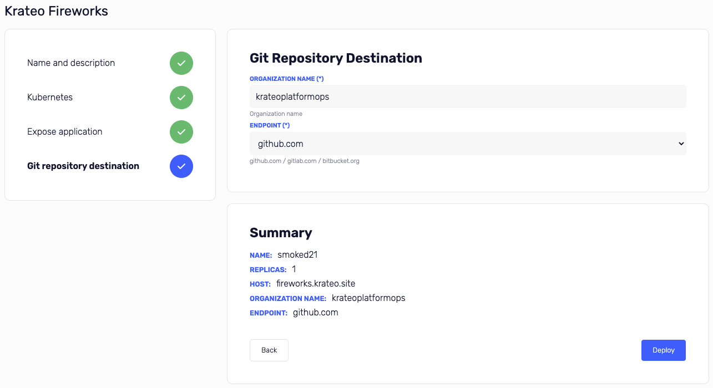
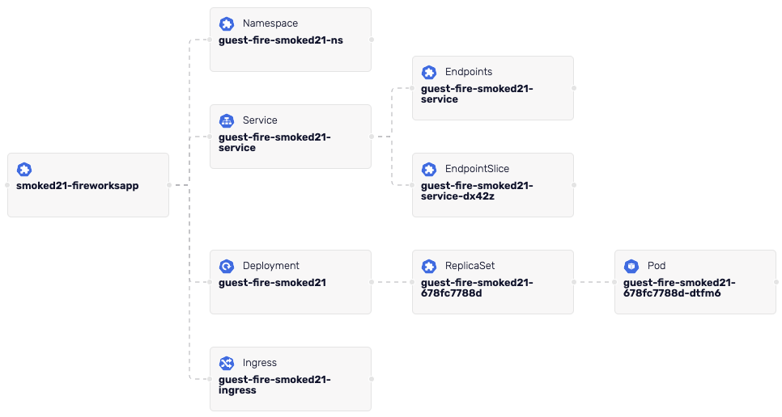

# Publish first Deployment

## Publish Fireworks App

1. Login to Krateo
2. Click on the left menu to `Templates`
3. If you have completed the previous steps you should see the template `Krateo Fireworks`
4. Click on the template card, and you will be redirect to the template form page
5. This template has only 4 steps, but 3 of these are already fulfilled, but you can custmizare them if you want
6. Step 1: the name of the deployment
7. Step 2: how many replicas you want to set
8. Step 3: how to expose application
9. Step 4, here it's time to config the deployment
   
   In this example we are going to publish the deployment to `krateoplatformops` organization.
10. If the form is valid, click on the `Publish` button
11. Now you have deployed your first application with Krateo! After a while navigate to the url you have set in the step 3, and you should see the fireworks application running.
    

## Deployment Page

This deployment has 8 tabs

### Overview

Description and link to the repository you have created

### Resources

Resource tree provided by ArgoCD

### Documentation

Here you will see the README.md file of the repository you have created. The content? Is the lyrics of the song "Fireworks" by Katy Perry

### Kubernetes

The list of components deployed in the cluster:

If you click on any component in the right pane you will see the yaml file of the component.

### Pipelines

This deployment trigger a pipeline (GitHub action) to build the docker image.

### Events

Here you will see the events related to the deployment.

### Values

It shows the deployment.yaml file of the deployment.

### Settings

If you are ready to delete the deployment, you can do it from here.
