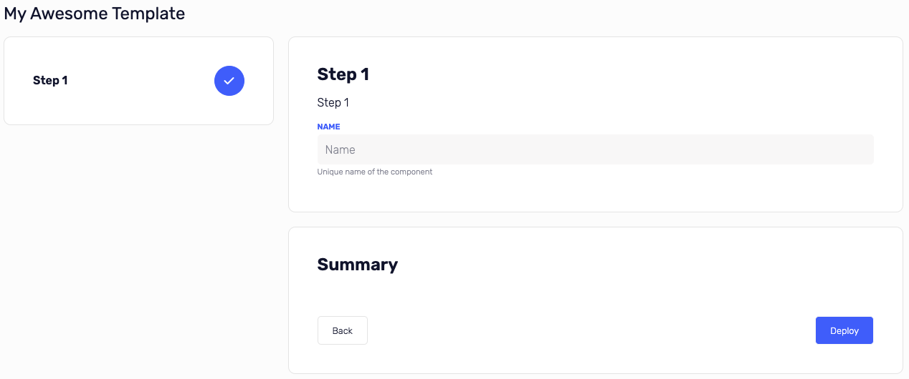

# Create a template

As every yaml file, the template.yaml is composed by 4 main sections:

- `apiVersion`: The version of the template
- `kind`: The kind of the template
- `metadata`: The metadata of the template
- `spec`: The spec of the template

This is a basic template.yaml file:

```yaml
apiVersion: krateo.io/v1alpha1
kind: Template
metadata:
spec:
```

## Set the name

```yaml
metadata:
  name: my-awesome-template
```

!!! Note

    The name of the template must be unique in the cluster and is for kubernetes use only.

## Set the basic information

```yaml
spec:
  owner: info@krateo.io
  title: My Awesome Template
  description: This is my first template
  icon: fa-solid fa-mug-hot
  tags:
    - awesome
    - template
    - krateo
    - coffee
```

!!! Note

    Title, description, icon and tags are used in the Krateo App.

## Set the widgets

Widgets are the steps in the template form.

```yaml
widgets:
  - title: Step 1
    description: Step 1
    properties:
      - title: Name
        key: name
        description: Unique name of the component
```

## Now you can import the template

If you don't know how to import the template follow this [guide](/docs/tutorials/import-template).

The template should be something like this:

```yaml
apiVersion: krateo.io/v1alpha1
kind: Template
metadata:
  name: my-awesome-template
spec:
  owner: info@krateo.io
  title: My Awesome Template
  description: This is my first template
  icon: fa-solid fa-mug-hot
  tags:
    - awesome
    - template
    - krateo
    - coffee
  widgets:
    - title: Step 1
      description: Step 1
      properties:
        - title: Name
          key: name
          description: Unique name of the component
```

And in Krateo you will see this:



The `deploy` button is enabled because there are no required fields.

## Add a required field and the box info

```yaml
widgets:
  - title: Step 1
    description: Step 1
    properties:
      - title: Name
        key: name
        description: Unique name of the component
        required: true
        default: my-awesome-component
      - value: Info box
        type: box
        style: success
```

After this, you can re-import the template and you will see this:


## Field types

As described [here](../app/app-templates#types) there are multiple type of fields.

## Need more help?

You can find some examples on our GitHub organization
[github.com/krateoplatformops](https://github.com/krateoplatformops?q=krateo-template&type=all&language=&sort=).
